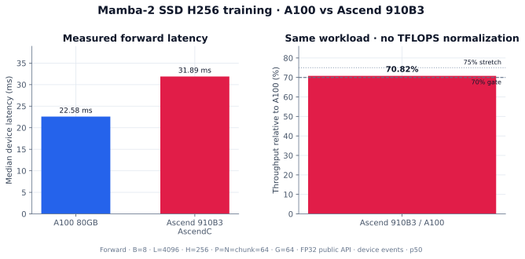
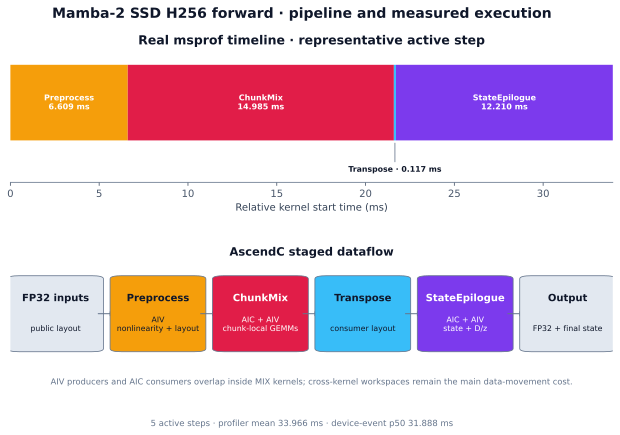
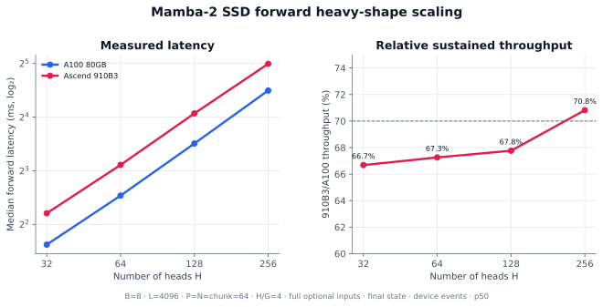
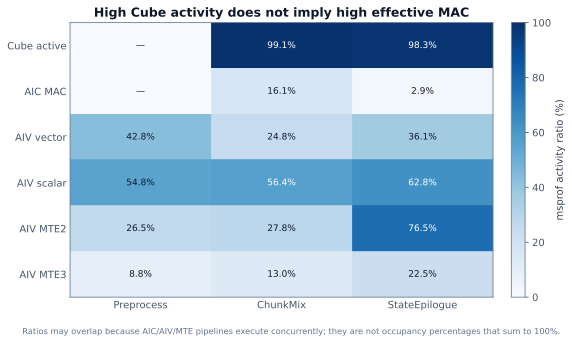
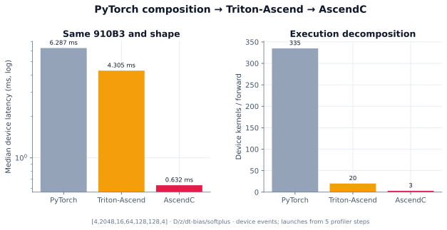
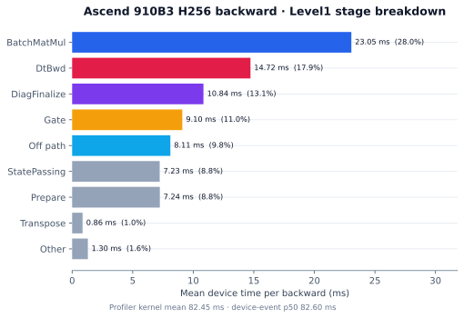
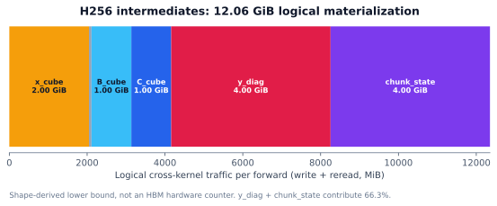
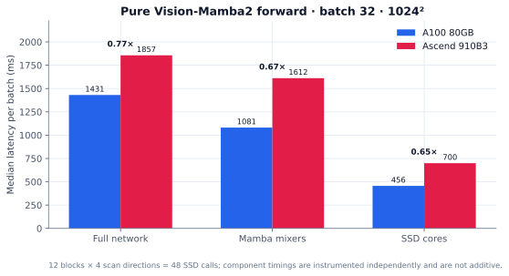

# Mamba-2 SSD for Ascend NPU

Mamba-2 Structured State Space Duality（SSD）核心算子的 PyTorch reference、
Triton-Ascend 和 AscendC 实现。AscendC 是当前 NPU 主路径；仓库同时提供
A100 `mamba_ssm` 对照、forward/backward 精度测试、device-event benchmark、
`torch_npu.profiler`/msprof 分析和纯 Vision-Mamba2 网络验证。

## 实现

| 路径 | Forward | Backward | 用途 |
|---|---|---|---|
| PyTorch reference | 支持 | PyTorch autograd | 数学定义与精度基线 |
| Triton-Ascend | 支持 | 未实现 | DSL 迁移与同 NPU 对照 |
| AscendC | 支持 | M0/M1 public autograd | NPU 训练与推理主路径 |
| A100 `mamba_ssm` | 官方实现 | 官方实现 | 跨平台性能和精度对照 |

公开接口对齐
`mamba_ssm.ops.triton.ssd_combined.mamba_chunk_scan_combined` 的张量语义：

```text
x                [B, L, H, P]
dt               [B, L, H]
A                [H]
B, C             [B, L, G, N]
initial_states   [B, H, P, N]       optional
out              [B, L, H, P]
final_state      [B, H, P, N]       optional
```

支持 `D`、`z`、`dt_bias`、`dt_softplus`、`dt_limit`、`initial_states` 和
`return_final_state`。Public tensor 为 FP32；Cube 内部使用 FP16 operand 与
FP32 accumulate。当前高性能 backward M1 路径要求 contiguous FP32 且
`P=N=chunk_size=64`。

### AscendC 执行路径

```text
ascend_kernel.mamba2_ssd_fwd
├─ Preprocess             AIV: softplus / clamp / decay / producer layout
├─ ChunkMix               AIC+AIV: chunk-local GEMMs and causal work
├─ Transpose              producer → state-consumer layout
└─ StateEpilogueTrain     AIC+AIV: state recurrence / projection / D/z

public autograd backward
├─ Prepare / PrepareDCB
├─ off-diagonal Cube BMM
├─ reverse StatePassing
├─ diagonal + chunk-state finalize
├─ DtBwd / Gate
└─ reductions and public-layout gradients
```

核心源码：

| 目录 | 内容 |
|---|---|
| [`mamba_torch/`](mamba_torch/) | PyTorch SSD reference 与 Vision-Mamba2 网络 |
| [`mamba_triton_ascend/mamba2/`](mamba_triton_ascend/mamba2/) | Triton-Ascend forward |
| [`mamba_ascendc/`](mamba_ascendc/) | PyTorch 扩展、public API、Vector 与 fallback kernels |
| [`mamba_ascendc_ops/`](mamba_ascendc_ops/) | AscendC Cube/MIX OPS 工程 |
| [`benchmarks/`](benchmarks/) | GPU/NPU benchmark 与 profiler 入口 |
| [`tests/mamba2/`](tests/mamba2/) | reference、GPU、Triton-Ascend 测试 |

## Benchmark

除非单独说明，性能结果使用相同 shape、FP32 public tensors、完整 optional
inputs、设备 Event、`warmup=10`、`repeat=30` 和 p50。A100 运行
`mamba_ssm 2.2.6.post3`；910B3 直接加载当前源码 `.so + OPP`，不经过已安装
wheel。理论 TFLOPS 未用于归一化，因为不同厂商、数据类型和统计口径不能直接
等价比较。

### A100 80GB 与 Ascend 910B3



主门禁固定 heavy training forward shape
`[B,L,H,P,N,chunk,G]=[8,4096,256,64,64,64,64]`，并返回 final state。

| 平台 | 实现 | Forward | 相对 A100 吞吐 |
|---|---|---:|---:|
| A100 80GB PCIe | `mamba_ssm` | `22.583 ms` | `100%` |
| Ascend 910B3 | AscendC | `31.888 ms` | `70.82%` |

图中第一部分给出绝对 latency，第二部分直接给出相同 workload 下的相对吞吐，
不使用 A100/910B3 的理论算力数字解释结果。当前 forward 已达到 70% 门禁；
75% stretch 目标为 `≤30.111 ms`。

### Forward pipeline 与 msprof timeline



上半部分来自 H256 forward 的真实 `kernel_details.csv`，下半部分对应实现中的
数据流。五个 active step 的统计如下：

| 指标 | 结果 |
|---|---:|
| profiler service time | `33.9664 ms/step` |
| device busy union | `33.9633 ms/step` |
| kernel 间空洞 | `0.00313 ms/step` |
| underfeed ratio | `0.00923%` |
| 最大 kernel 间隙 | `0.0015 ms` |
| 正式 device-event p50 | `31.8882 ms` |

因此这个 shape 不是 launch/host underfeed 主导：四个设备阶段几乎无缝衔接。
profiler 自身使 wall time 比 device-event p50 高约 6.5%，所以 profiler 只用于
阶段分解，跨平台表使用 device Event。

完整证据见
[`H256 profiling architecture report`](docs/profiling/model_architecture_report_profile_fwd_h256_910b3_final_20260810.md)
和
[`anomaly JSON`](docs/profiling/mamba2_h256_fwd_anomaly_20260810.json)。

### Heavy-shape scaling



固定 `B=8,L=4096,P=N=chunk=64,H/G=4`，将 head 从 32 扩展到 256。图中
左图是绝对 latency，右图为 `A100 latency / 910B3 latency`，即 910B3 相对
A100 的持续吞吐。

| H / G | A100 FWD | 910B3 FWD | 910B3/A100 吞吐 |
|---:|---:|---:|---:|
| 32 / 8 | `3.080 ms` | `4.619 ms` | `66.68%` |
| 64 / 16 | `5.805 ms` | `8.631 ms` | `67.26%` |
| 128 / 32 | `11.379 ms` | `16.793 ms` | `67.76%` |
| 256 / 64 | `22.583 ms` | `31.888 ms` | `70.82%` |

两端进入 sustained scaling 后 latency 均近似随 head 线性增加。H256 的
Forward 使用单 case 隔离复测值，避免多 case 串行 sweep 的显存/cache 状态影响。

### Hardware utilization



| Stage | Mean latency | Cube active | AIC MAC | AIV MTE2 | 结论 |
|---|---:|---:|---:|---:|---|
| Preprocess | `6.667 ms` | - | - | `26.5%` | Vector/control 与输入布局 |
| ChunkMix | `14.850 ms` | `99.1%` | `16.1%` | `27.8%` | AIC 持续工作，但有效 MAC 仍低 |
| StateEpilogue | `12.303 ms` | `98.3%` | `2.9%` | `76.5%` | 数据搬运与低密度 projection 主导 |

`Cube active` 表示 Cube pipeline 被持续调度，不等于每个周期都在执行有效 MMAD。
不同 engine 的 activity 可以重叠，不能相加为 100%。当前最明确的 forward
优化方向是 StateEpilogue 的 consumer layout、GM→UB 搬运和小矩阵映射，而不是
继续减少已经只有微秒级的 kernel gap。

### PyTorch / Triton-Ascend / AscendC



三种实现运行在同一张 910B3 上，shape 为
`[4,2048,16,64,128,128,4]`，并启用 `D/z/dt_bias/softplus`。

| NPU 实现 | p50 latency | Kernels / forward | 相对 PyTorch | 相对 Triton |
|---|---:|---:|---:|---:|
| PyTorch composition | `6.287 ms` | `335` | `1.00×` | `0.68×` |
| Triton-Ascend | `4.305 ms` | `20` | `1.46×` | `1.00×` |
| AscendC | `0.632 ms` | `3` | `9.94×` | `6.81×` |

这是同平台实现层级对比，不表示“AscendC 语言固定比 Triton 快 6.81×”。差异来自
算子融合、kernel 数量、中间 tensor 物化、Cube/Vector 映射和数据布局的共同变化。

### Backward breakdown



H256 backward 的 profiler kernel mean 为 `82.454 ms`，与 device-event p50
`82.596 ms` 一致。主要阶段为：

| Stage | Mean latency | BWD 占比 |
|---|---:|---:|
| BatchMatMul | `23.053 ms` | `28.0%` |
| DtBwd | `14.723 ms` | `17.9%` |
| DiagFinalize | `10.841 ms` | `13.1%` |
| Gate | `9.096 ms` | `11.0%` |
| Off path | `8.111 ms` | `9.8%` |
| StatePassing | `7.229 ms` | `8.8%` |
| Prepare | `7.242 ms` | `8.8%` |

最大单项是 Cube BMM，但优化不能只看 Cube utilization：BMM 输出仍需落 GM 并由
Vector consumer 读回。下一轮应优先共设计 BMM 输出与 Vector consumer layout，
其次继续做 Gate/Dt 的 head-block contiguous tiling 和受控 AIC/AIV pipeline。

### Cross-kernel data movement



H256 forward 的 shape-derived logical lower bound 为 `12.06 GiB` 中间结果写回+
重读，其中 `y_diag` 与 `chunk_state` 合计 `8 GiB`（`66.3%`）。这是根据 tensor
shape 计算的跨 kernel 物化量，不是 msprof HBM bandwidth counter。它解释了为什么
head 增大后 latency 线性增长，也说明简单把更多计算交给 Cube 并不能消除
producer/consumer layout 不匹配。

### Vision-Mamba2 integration



纯 Vision-Mamba2 tiny 网络使用 12 个 Mamba block、4 个扫描方向，每次 forward
调用 48 次 SSD。batch 32、`1024×1024` 图像的结果：

| 范围 | A100 80GB | Ascend 910B3 | 910B3/A100 吞吐 |
|---|---:|---:|---:|
| Full network | `1430.8 ms` | `1856.6 ms` | `0.771×` |
| Mamba mixers | `1081.4 ms` | `1611.6 ms` | `0.671×` |
| SSD cores | `455.9 ms` | `699.7 ms` | `0.651×` |

跨设备 logits 对拍为 MaxAbs `3.76e-4`、NRMSE `3.42e-4`、cosine
`1.00000048`。Full network 单独计时；Mixer/SSD 来自 instrumented forward，
组件时间不可直接相加。

机器可读的 README 数据快照位于
[`benchmarks/results/readme_benchmarks.json`](benchmarks/results/readme_benchmarks.json)，
图表由 [`benchmarks/plot_readme_figures.py`](benchmarks/plot_readme_figures.py)
生成。

## 精度

AscendC 以 PyTorch reference 作为 oracle。Cube 内部使用 mixed precision，因此按
NRMSE、cosine、finite 和定向梯度检查共同验收，不宣称纯 FP32 GEMM 精度。

| 范围 | 结果 | 最差 NRMSE | 最低 cosine |
|---|---:|---:|---:|
| Grouped forward + determinism | `4/4 PASS` | 见原始报告 | 见原始报告 |
| M1 full-feature backward | `41/41 PASS` | `1.078e-3` | `0.999992847` |
| Vision-Mamba2 NPU/A100 logits | PASS | `3.418e-4` | `1.00000048` |

Backward 报告：
[`mamba2_ssd_bwd_m1_precision_report_910b3-70pct-final-20260809.md`](mamba_ascendc/tests/mamba2_ssd_bwd_m1_precision_report_910b3-70pct-final-20260809.md)。

## 安装

需要已配置的 CANN、PyTorch、torch_npu 和 AscendC 编译环境。已验证组合：

| 组件 | Ascend 910B3 | Ascend 950PR |
|---|---|---|
| CANN | 8.2.RC1 | 9.0.0 |
| Python | 3.11 | 3.11 |
| PyTorch / torch_npu | 2.6.0 / 2.6.0 | 2.7.1 / 2.7.1.post4 |
| Triton-Ascend | 3.2.0 | 3.2.1 |

构建并安装包含 custom OPP 的 wheel：

```bash
git clone https://github.com/So-cean/mamba-ascendc.git
cd mamba-ascendc

export ASCEND_HOME_PATH=/path/to/ascend-toolkit/latest
bash scripts/build_mamba_ascendc_wheel.sh
python -m pip install dist/mamba_ascendc-0.1.0-*.whl --no-deps
```

wheel 包含 operator binary、custom OPP、`libcust_opapi.so` 和
`libascend_kernel.so`；安装后导入 `ascend_kernel` 会完成运行时注册。

## 使用

### AscendC inference

```python
import torch
import torch_npu
from ascend_kernel import mamba2_ssd_fwd

device = "npu"
B, L, H, P, N, G = 1, 128, 2, 64, 128, 1

x = torch.randn(B, L, H, P, device=device, dtype=torch.float32)
dt = torch.rand(B, L, H, device=device, dtype=torch.float32)
A = -torch.rand(H, device=device, dtype=torch.float32)
Bt = torch.randn(B, L, G, N, device=device, dtype=torch.float32)
Ct = torch.randn(B, L, G, N, device=device, dtype=torch.float32)

out, final_state = mamba2_ssd_fwd(
    x, dt, A, Bt, Ct,
    chunk_size=128,
    dt_softplus=True,
    return_final_state=True,
)
```

完整示例：[`examples/mamba2_ascendc_demo.py`](examples/mamba2_ascendc_demo.py)。

### AscendC training

```python
for tensor in (x, dt, A, Bt, Ct):
    tensor.requires_grad_(True)

out, final_state = mamba2_ssd_fwd(
    x, dt, A, Bt, Ct,
    chunk_size=64,
    D=D,
    z=z,
    dt_bias=dt_bias,
    dt_softplus=True,
    initial_states=initial_states,
    return_final_state=True,
)

loss = out.square().mean() + final_state.square().mean()
loss.backward()
```

当前 M1 native-core backward 需要 contiguous FP32、`P=N=chunk_size=64`。
不满足 M1 规格时，仅支持域内 basic case 会走 M0 correctness fallback；其他训练
规格显式抛出 `NotImplementedError`。

### PyTorch reference

```python
from mamba_torch import ssd_chunk_scan_ref

out, final_state = ssd_chunk_scan_ref(
    x, dt, A, Bt, Ct,
    chunk_size=128,
    return_final_state=True,
)
```

### Triton-Ascend

```python
from mamba_triton_ascend.mamba2 import mamba_chunk_scan_combined

out, final_state = mamba_chunk_scan_combined(
    x, dt, A, Bt, Ct,
    chunk_size=128,
    return_final_states=True,
    backend="triton",
)
```

## 验证与复现

开发阶段直接加载源码候选，不通过 wheel，避免环境中旧 OPP 抢先加载：

```bash
cd mamba_ascendc_ops/mamba2_ssd_chunk_mix
bash build.sh
cd ../../mamba_ascendc
MAMBA_ASCENDC_DEV_BUILD=1 ./build.sh <soc-version>
cd ..

MAMBA2_TEST_EXTENSION_LIB=$PWD/mamba_ascendc/python/ascend_kernel/ascend_kernel/lib/libascend_kernel.so \
MAMBA2_TEST_OPP_ROOT=$PWD/mamba_ascendc_ops/mamba2_ssd_chunk_mix/build_out/packages \
python mamba_ascendc/tests/run_source_candidate.py <test-file.py>
```

常用验证：

```bash
# CPU reference
pytest -q tests/mamba2/test_reference.py

# A100 mamba_ssm vs reference
pytest -q tests/mamba2/test_gpu_reference.py

# Triton-Ascend vs reference
pytest -q tests/mamba2/test_npu_compile.py tests/mamba2/test_npu_triton_fwd.py

# AscendC forward demo and M1 backward precision
python examples/mamba2_ascendc_demo.py
pytest -q mamba_ascendc/tests/test_mamba2_ssd_bwd_m1.py \
  mamba_ascendc/tests/test_mamba2_ssd_bwd_m1_precision.py
python mamba_ascendc/tests/run_mamba2_ssd_bwd_m1_precision_report.py
```

性能：

```bash
# A100 official mamba_ssm
python benchmarks/mamba2_gpu_bench.py \
  --cases medium extreme --warmup 30 --repeat 200

# Triton-Ascend
python benchmarks/mamba2_triton_ascend_bench.py \
  --cases medium extreme --warmup 30 --repeat 200

# AscendC
python benchmarks/mamba2_npu_final_bench.py \
  --cases medium extreme --warmup 30 --repeat 200 --skip-precision

# Forward/backward unified benchmark
python benchmarks/mamba2_backward_bench.py \
  --backend ascendc --device npu --cases m1_extreme \
  --feature full --warmup 10 --repeat 30

# Regenerate README figures
python benchmarks/plot_readme_figures.py
```

benchmark 口径、字段和更多命令见 [`benchmarks/README.md`](benchmarks/README.md)。

## 当前限制与后续工作

- Public dtype 当前为 FP32；Cube 内部使用 FP16 operand。
- M1 backward 当前只覆盖 contiguous `P=N=chunk=64`，varlen/packed sequence
  尚未实现。
- Forward 下一阶段目标是将 H256 提升到 A100 吞吐的 75%；优先处理
  StateEpilogue consumer layout、`y_diag/chunk_state` 物化和低密度 Cube 映射。
- Backward 优先共设计 Cube BMM 输出与 Vector consumer layout，再优化 Gate/Dt
  的 head-block contiguous tiling 和 AIC/AIV pipeline。
- 需要继续扩展 BF16、更多 `N/chunk_size`、`seq_idx/cu_seqlens` 和模型训练回归。

## 参考项目

- [state-spaces/mamba](https://github.com/state-spaces/mamba) — Mamba/Mamba-2 官方实现
- [Transformers are SSMs: Generalized Models and Efficient Algorithms Through Structured State Space Duality](https://arxiv.org/abs/2405.21060)
- [triton-lang/triton](https://github.com/triton-lang/triton)
- [Ascend/triton-ascend](https://github.com/Ascend/triton-ascend)
- [Ascend/samples](https://github.com/Ascend/samples) — AscendC 自定义算子样例
- [MzeroMiko/VMamba](https://github.com/MzeroMiko/VMamba)
